# Módulo 12 — Patrones de arquitectura en DDD: Puertos y Adaptadores

Objetivo: profundizar en la clasificación de puertos y adaptadores, su organización en Node.js y buenas prácticas para garantizar un acoplamiento mínimo y máxima testabilidad.

**Nota de contexto:**

- Un **Puerto** es una interfaz dentro de la capa de aplicación que define un contrato: _qué_ hace el sistema, sin detallar _cómo_.
- Un **Adaptador** es la implementación concreta de ese contrato, en la capa de infraestructura: _cómo_ interactúa con una base de datos, un broker de mensajes o un framework HTTP.

---

## 0. Arquitectura por capas vs arquitectura hexagonal (por qué importa)

Es habitual mezclar “arquitectura por capas” y “puertos/adaptadores”, así que conviene entender bien ambos enfoques.

- **Arquitectura por capas** (presentación → lógica → datos) organiza responsabilidades, pero puede terminar con dependencias “hacia abajo” que contaminan el dominio (si el dominio depende de ORM/HTTP).
- **Hexagonal** mantiene el dominio/aplicación en el centro y obliga a que la infraestructura dependa del core mediante puertos (DIP).

### 0.1 Capas: presentación, lógica empresarial y acceso de datos

- **Capa de presentación**: controladores/handlers (HTTP, CLI, consumidores) y mapeo de DTOs.
- **Capa de lógica empresarial**: casos de uso + dominio (reglas y decisiones).
- **Capa de acceso de datos**: persistencia e integraciones (DB, brokers, APIs externas).
- **Comunicación entre capas**: la presentación delega en la lógica; la lógica depende de abstracciones; los detalles (datos/infra) implementan esas abstracciones.

En la práctica:

- La **capa de presentación** suele ser un adaptador de entrada (HTTP/CLI/consumer).
- La **capa de acceso a datos** y mensajería suelen ser adaptadores de salida (DB/MQ/APIs externas).
- Los **Use Cases** (aplicación) coordinan puertos y ejecutan reglas de negocio sin detalles técnicos.

## 1. Taxonomía de puertos y adaptadores

| Tipo                 | Alias                | Definido en                   | Ejemplos                                     |
| -------------------- | -------------------- | ----------------------------- | -------------------------------------------- |
| Puerto de Entrada    | Driving / Primary    | Capa de aplicación            | RegisterUserCommand, GetOrderQuery           |
| Puerto de Salida     | Driven / Secondary   | Capa de aplicación            | UserRepositoryPort, PaymentGatewayPort       |
| Adaptador de Entrada | Controller / Handler | Infraestructura (HTTP, CLI)   | FastifyHandler, GraphQLResolver, CLIParser   |
| Adaptador de Salida  | Gateway              | Infraestructura (DB, MQ, API) | PostgresUserRepository, StripePaymentGateway |

### 1.1 Puertos de entrada y salida en la arquitectura hexagonal

- **Puerto de entrada**: define cómo “se invoca” un caso de uso (desde HTTP, CLI o consumo de eventos).
- **Puerto de salida**: define cómo el caso de uso interactúa con dependencias externas (repositorio, bus de eventos, terceros).

### 1.2 ¿Cómo se relacionan los puertos con los Domain Object y los casos de uso?

- Los **Domain Objects** viven en dominio (entidades/VO/agregados) y representan reglas e invariantes.
- Los **casos de uso** viven en aplicación y orquestan Domain Objects.
- Los **puertos** son el pegamento: el caso de uso se define como puerto de entrada y consume puertos de salida para persistir/publicar/integrar.

### 1.3 Creando un puerto de entrada y salida en un proyecto Node bajo un modelo de arquitectura hexagonal

Ejemplo mínimo (entrada + salida):

```ts
// application/ports/ReserveStockPort.ts (puerto de entrada)
export type ReserveStockCommand = { sku: string; qty: number; orderId: string };
export interface ReserveStockPort {
  execute(command: ReserveStockCommand): Promise<void>;
}

// application/ports/InventoryRepositoryPort.ts (puerto de salida)
import type { ProductInventory } from "../../domain/model/ProductInventory";
export interface InventoryRepositoryPort {
  findBySku(sku: string): Promise<ProductInventory | null>;
  save(inventory: ProductInventory): Promise<void>;
}
```

### 1.4 Tipos de adaptadores en la arquitectura hexagonal

- **Adaptadores de entrada**: reciben “intenciones” (HTTP, CLI, consumers) y traducen a comandos/queries del core.
- **Adaptadores de salida**: implementan puertos para infraestructura (DB, broker, APIs externas, cache).
- **Adaptadores de traducción**: *mappers/ACL* entre modelos cuando integras bounded contexts (evita acoplamiento).

## 2. Diagrama conceptual (Mermaid)

```mermaid
flowchart LR
  subgraph Domain["🔷 Domain"]
    D1[Entities & Aggregates]
    D2[Value Objects]
    D3[Use Cases & Services]
  end
  subgraph Ports["⚙️ Ports"]
    P1[InventoryRepositoryPort]
    P2[PaymentGatewayPort]
  end
  subgraph Adapters["🔌 Adapters"]
    A1[PostgresInventoryRepo]
    A2[RabbitMQAdapter]
    A3[StripePaymentGateway]
    A4[HTTP InventoryHandler]
  end
  D3 --> P1
  D3 --> P2
  P1 --> A1
  P2 --> A3
  A4 --> D3
```



## 3. Ejemplo de puerto de salida: PaymentGatewayPort

### 3.1. Definición del puerto

```typescript
// src/domain/ports/PaymentGatewayPort.ts
/**
 * Puerto de salida: define el contrato para procesar pagos.
 * La capa de dominio solo conoce esta interfaz.
 */
export interface PaymentGatewayPort {
  charge(amount: number, currency: string): Promise<{ receiptId: string }>;
}
```

### 3.2. Implementación concreta del puerto

```typescript
// src/infrastructure/stripe/StripePaymentGateway.ts
import Stripe from "stripe";
import { PaymentGatewayPort } from "../../domain/ports/PaymentGatewayPort";

/**
 * Implementación concreta del puerto usando la librería Stripe.
 */
export class StripePaymentGateway implements PaymentGatewayPort {
  private client: Stripe;
  constructor() {
    // La clave se inyecta vía env var
    this.client = new Stripe(process.env.STRIPE_KEY!, {
      apiVersion: "2022-11-15",
    });
  }
  async charge(
    amount: number,
    currency: string
  ): Promise<{ receiptId: string }> {
    const charge = await this.client.charges.create({ amount, currency });
    return { receiptId: charge.id };
  }
}
```

## 4. Adaptador de entrada: HTTP Handler

```typescript
// src/infrastructure/http/inventory-routes.ts
import { FastifyInstance } from "fastify";
import { container } from "../../application/container";
import { ReserveStockUseCase } from "../../application/use-cases/ReserveStockUseCase";

/**
 * Registra rutas HTTP y delega en UseCases.
 * Este adapter traduce request/response ↔ objetos de dominio.
 */
export async function registerInventoryRoutes(app: FastifyInstance) {
  const reserveUseCase = container.resolve<ReserveStockUseCase>(
    "reserveStockUseCase"
  );
  app.post("/inventory/:sku/reserve", async (req, reply) => {
    const { sku } = req.params as { sku: string };
    const { qty } = req.body as { qty: number };
    // Ejemplo de Lógica de negocio en el adaptador. EVITAR!!!
    if (!sku || qty <= 0) {
      return reply
        .status(400)
        .send({ error: "SKU inválido o cantidad no positiva" });
    }
    await reserveUseCase.execute(sku, qty);
    reply.status(204).send();
  });
}
```

## 5. Inversión de Dependencias (DIP) en main.ts

```typescript
// src/main.ts
import Fastify from "fastify";
import { setupContainer } from "./application/container"; // función que registra todo
import { registerInventoryRoutes } from "./infrastructure/http/inventory-routes";

export async function buildServer() {
  const container = setupContainer();         // ← wiring explícito
  const app = Fastify({ logger: true });

  await registerInventoryRoutes(app, container); // ← se lo pasas al router
  return app;
}

if (import.meta.url === `file://${process.argv[1]}`) {
  buildServer()
    .then(app => app.listen({ port: +process.env.PORT! }))
    .catch(err => { console.error(err); process.exit(1); });
}
```

## 6. Anti-patrones comunes

| Anti-patrón         | Riesgo                                  | Solución recomendada                        |
| ------------------- | --------------------------------------- | ------------------------------------------- |
| Fat Adapter         | Mezcla lógica de negocio en controllers. Ver Punto 4. | Extraer lógica a UseCases / Domain Services |
| Domain (Head Up Display) HUD          | Logging/tracing directo en entidades    | Inyectar un LoggerPort en adaptadores       |
| Anonymous Interface | Usar any para puertos, perdiendo tipado | Definir interfaces específicas y pequeñas   |

## 7. Buenas prácticas

1. Puertos “skinny”: interfaces de 1–3 métodos con responsabilidad clara.
2. Adaptadores “thin”: realizan validación y mapeo de DTOs ↔ entidades; toda la lógica de negocio permanece en el dominio o en Use Cases.
3. Use Cases orquestan: coordinan puertos, adaptadores y emisión de eventos, evitando lógica dispersa.
4. Tests unitarios de adapters: verificar que un adapter cumple el contrato en memoria sin necesidad de servicios externos.

### Ejemplo de test unitario para un adapter de salida

```typescript
// tests/infrastructure/postgres/InventoryRepositoryPostgres.test.ts
import { InventoryRepositoryPostgres } from "../../../src/infrastructure/postgres/InventoryRepositoryPostgres";
import { PrismaClient } from "@prisma/client";
import { ProductInventory } from "../../../src/domain/model/ProductInventory";

describe("InventoryRepositoryPostgres", () => {
  let prisma: PrismaClient;
  let repo: InventoryRepositoryPostgres;

  beforeAll(() => {
    // Aquí podríamos usar Prisma Client con una base de datos SQLite en memoria
    prisma = new PrismaClient({
      datasources: { db: { url: "file:./test.db?mode=memory&cache=shared" } },
    });
    repo = new InventoryRepositoryPostgres(prisma);
  });

  afterAll(async () => {
    await prisma.$disconnect();
  });

  it("save y findBySku funcionan correctamente", async () => {
    const sku = "TEST123";
    const inventory = new ProductInventory(sku, 10);

    await repo.save(inventory);
    const fetched = await repo.findBySku(sku);

    expect(fetched).not.toBeNull();
    expect(fetched!.sku).toBe(sku);
    expect(fetched!.available).toBe(10);
  });
});
```

---

## 8. Segregación de responsabilidad entre comandos y consultas (CQRS)

Una fuente común de acoplamiento es “un endpoint que hace de todo”: valida, cambia estado, consulta y compone respuestas complejas. Esto se suele formalizar como **segregación de comandos y consultas**.

- **Command**: intención de cambiar estado (p. ej. `ReserveStock`).
  - Devuelve `204/202` o un *resource id*, pero evita devolver grandes lecturas.
- **Query**: intención de leer estado (p. ej. `GetInventoryBySku`).
  - No cambia estado; puede optimizarse con caché/proyecciones.

En hexagonal, lo habitual es:

- Commands → Use Case (puerto de entrada) → puertos de salida (repo/bus) → persistencia/eventos.
- Queries → Query handler (puerto de entrada) → repos de lectura / read models.

---

## 9. Scope (ciclo de vida) y DI en microservicios

El *scope* evita fugas de estado y reduce bugs difíciles:

- **Singleton**: clientes (PrismaClient, RabbitMQ connection) y *SDKs* compartidos.
- **Scoped/per-request**: repositorios/adaptadores que dependen del request o de un “unit of work”.
- **Transient**: objetos sin estado (mappers, factories pequeñas).

Regla práctica: si una dependencia mantiene estado mutable, evita que sea singleton salvo que esté diseñada para ello.
