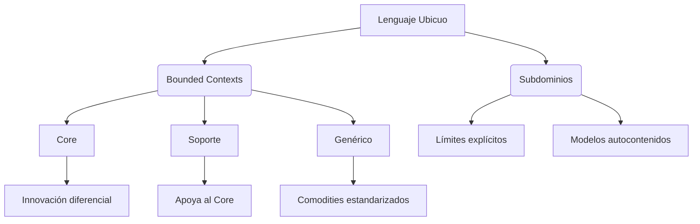
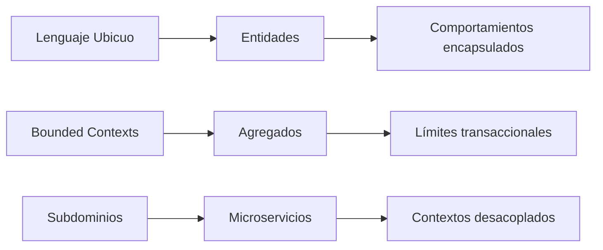
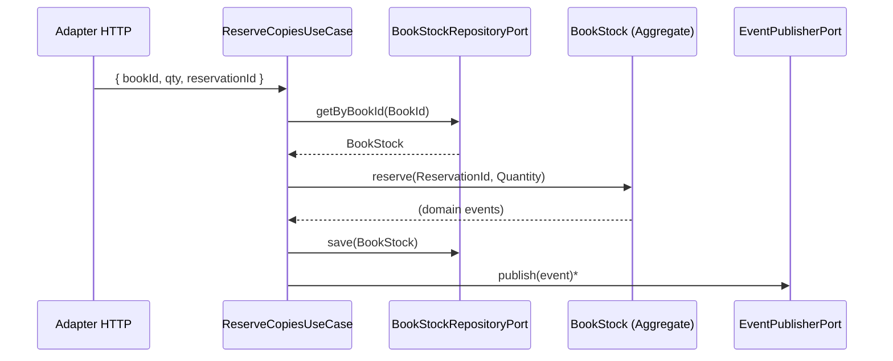

# Módulo 9 — Domain-Driven Design (DDD): fundamentos (estratégico → táctico)

> Este documento conecta DDD con límites de microservicios y con el paso práctico más importante del curso: **salir del modelo anémico** hacia un **modelo rico** (invariantes + comportamiento en el dominio).

## 0. ¿Qué es DDD?

DDD (*Domain‑Driven Design*) es un enfoque de diseño en el que el **dominio (negocio)** guía la forma del software: modelamos reglas e invariantes con el **lenguaje del negocio**, y hacemos que el código sea una representación fiel y evolutiva de ese conocimiento.

DDD se trabaja en dos planos complementarios:

- **Patrones estratégicos**: dividir el problema en subdominios y **contextos delimitados**, y definir sus relaciones.
- **Patrones tácticos**: expresar el modelo dentro de cada contexto con entidades, value objects, agregados, eventos, repositorios y casos de uso.

## 1. Patrones estratégicos

Antes de abordar los modelos de dominio, es crucial entender los cimientos que hacen posible el diseño guiado por el dominio:



---

## 2. Lenguaje ubicuo (Lenguaje común): la columna vertebral de DDD

¿Qué es el lenguaje ubicuo? Un vocabulario compartido entre expertos de negocio y desarrolladores, alineado al **lenguaje empresarial** y reflejado en código, tests y documentación.

Patrones clave:
- Glosario de términos técnicos‑negocio (ej: “reserva” = `ReservationId` aplicado a `BookStock`)
- Diagramas que reflejan lenguaje de negocio (no solo UML técnico)
- Documentación viva en el código (tipos, métodos y tests con nombres de dominio)

## 3. ¿Qué es un contexto delimitado? (Bounded Context)

Un **contexto delimitado** es un límite donde un modelo tiene significado estable. Dentro del contexto, un término (“Pedido”) significa una cosa; fuera, puede significar otra.

| Tipo | Características | Ejemplo en e-commerce |
|------|----------------|----------------------|
| Core | Ventaja competitiva única | Sistema de recomendaciones AI |
| Soporte | Necesario pero no diferenciador | Gestión de inventario |
| Genérico | Problemas comunes ya resueltos | Pasarela de pagos |

### 3.1 Dominios principales (Core Domain)

El **Core Domain** es la parte del negocio donde la organización compite de verdad (ventaja diferencial). Heurísticas para identificarlo:

- Donde hay reglas que cambian con frecuencia por estrategia de negocio.
- Donde “comprar una solución” no resuelve (necesitas modelado propio).
- Donde conviene concentrar a los perfiles más fuertes (y proteger el contexto con contratos claros).

## 4. Subdominios

Principio: "Un término no puede significar dos cosas en el mismo contexto"

Implementación técnica:
- Microservicios con APIs bien definidas
- Módulos/librerías con responsabilidades acotadas
- Eventos de dominio con semántica contextual

### 4.1 Límites

Un buen límite reduce fricción:

- **Invariantes**: qué reglas requieren consistencia fuerte.
- **Lenguaje**: dónde cambia el significado de los términos.
- **Ritmo de cambio**: qué evoluciona junto y qué no.

### 4.2 Límites físicos

Son límites de ejecución/despliegue: procesos, contenedores, redes, DBs. En microservicios, suelen alinearse con bounded contexts, pero se negocian por coste operativo.

### 4.3 Límites de propiedad

El límite de propiedad define **quién es responsable** (equipo/área) de un contexto. Es clave para reducir coordinación y clarificar “quién decide” sobre contratos y evolución.

## 5. Conocimiento y gestión de la complejidad del dominio

DDD es, ante todo, un proceso para convertir **problemas de negocio** en un **modelo del dominio empresarial** que sea útil para construir software.

### 5.1 Problemas de negocio

Un problema de negocio se formula como una necesidad/restricción (“no puedo prometer stock si no hay disponibilidad”) y no como una solución técnica (“pon Redis”).

### 5.2 Descubrimiento del conocimiento

Técnicas comunes: entrevistas con expertos, *Example Mapping*, *Event Storming* y revisión de incidentes/soporte para encontrar reglas reales (las que no estaban en los tickets).

### 5.3 Comunicación

La comunicación continua (negocio ↔ ingeniería) evita que el software modele “suposiciones”. En DDD, el lenguaje ubicuo es el artefacto compartido que reduce malentendidos.

### 5.4 Lenguaje empresarial

Es el vocabulario que el negocio usa: términos, estados, políticas y excepciones. Mantenerlo explícito (glosario + ejemplos) es más efectivo que documentar solo endpoints.

### 5.5 Modelo del dominio empresarial

El modelo del dominio empresarial es una representación conceptual de reglas, estados y procesos: entidades relevantes, invariantes, eventos y decisiones.

### 5.6 ¿Qué es un modelo?

Un modelo es una simplificación útil de la realidad: captura lo importante para tomar decisiones y construir software, ignorando el resto.

### 5.7 Modelado efectivo

- Modela con **ejemplos** (casos normales y bordes) y convierte ejemplos en tests.
- Mantén agregados pequeños y APIs expresivas (métodos con intención, no setters).
- Separa modelos cuando el lenguaje cambia: un “Pedido” no es igual en logística y en pagos.

### 5.8 Modelos inconsistentes en la arquitectura hexagonal

En hexagonal es habitual tener varios modelos (dominio, DTOs HTTP, eventos de integración). La inconsistencia aparece cuando:

- el dominio se contamina con DTOs/ORMs, o
- distintos adapters “redefinen” conceptos (duplicidad semántica).

Antídotos: **traducción en adaptadores**, puertos explícitos, y *anti‑corruption layers* entre contextos.

## 6. Patrones tácticos (de estratégico a implementación)
Estos pilares estratégicos nos llevan naturalmente a implementaciones tácticas:



Flujo de diseño recomendado:
- Identificar subdominios clave con expertos de negocio.
- Delimitar Bounded Contexts para cada subdominio.
- Modelar agregados y entidades usando el Lenguaje Ubicuo.
- Implementar comportamientos ricos que reflejen reglas de negocio.

---

## 7. El problema del "Anemic Domain Model"

Objetivo: Comprender por qué el modelo anémico dificulta la evolución del software y cómo un dominio rico encapsula reglas, invariantes y comportamientos dentro de las entidades.

### 7.1 Ejemplo (anémico) usando el mini‑dominio del curso

En el curso usamos un proxy de inventario: **biblioteca** (stock de copias de libros) para practicar sin depender de infraestructura.

Un modelo anémico típico empieza así:

```ts
// (anémico) BookStockRow.ts
export type BookStockRow = {
  bookId: string;
  availableCopies: number;
  reservations: Array<{ reservationId: string; qty: number }>;
};

export function reserveCopies(
  row: BookStockRow,
  command: { reservationId: string; qty: number }
): BookStockRow {
  // Reglas dispersas + validación “a medias”
  if (!Number.isInteger(command.qty) || command.qty <= 0) throw new Error("Invalid qty");
  const reservedTotal = row.reservations.reduce((acc, r) => acc + r.qty, 0);
  const availableToReserve = row.availableCopies - reservedTotal;
  if (command.qty > availableToReserve) throw new Error("Insufficient stock");

  return {
    ...row,
    reservations: [...row.reservations, { reservationId: command.reservationId, qty: command.qty }]
  };
}
```

**Olor típico:** el mismo concepto (cantidad, idempotencia, stock disponible) acaba duplicado en handlers HTTP, repositorios, tests… y los invariantes no están protegidos por diseño.

---

**Problemas principales:**  
- Imposible garantizar invariantes (ej. que qty > 0, status sólo permitido).  
- Tests caros (requieren base de datos o mocks de servicios).  
- Refactors que **conllevan** riesgos: si cambias la tabla o el DTO rompes toda la lógica.

Referencia: Martin Fowler, “Anemic Domain Model” – https://martinfowler.com/bliki/AnemicDomainModel.html

---

## 8. Refactor a un Domain Model Rico

Un **modelo rico** coloca la lógica de negocio dentro de las propias entidades y agregados. Así cada objeto sabe cómo validarse y comportarse.

### 8.1 Value Objects (invariantes explícitas)

Primero capturamos las reglas en Value Objects. Ejemplo (del mini‑proyecto):

```ts
// .local/dia-04-referencia/src/domain/Quantity.ts
import { InvalidQuantityError } from "./errors.js";

export class Quantity {
  private constructor(private readonly value: number) {}

  static of(n: number): Quantity {
    if (!Number.isInteger(n) || n <= 0) {
      throw new InvalidQuantityError("Quantity must be a positive integer.");
    }
    return new Quantity(n);
  }

  toNumber(): number {
    return this.value;
  }
}
```

La misma idea aplica a identificadores:

```ts
// .local/dia-04-referencia/src/domain/BookId.ts
import { InvalidBookIdError } from "./errors.js";

export class BookId {
  private static readonly pattern = /^BOOK-\d{4}$/;
  private constructor(private readonly value: string) {}

  static of(raw: string): BookId {
    if (!BookId.pattern.test(raw)) {
      throw new InvalidBookIdError(
        "BookId must match format BOOK-0001 (e.g. BOOK-0001)."
      );
    }
    return new BookId(raw);
  }

  toString(): string {
    return this.value;
  }
}
```

Con esto, “cantidad” y “ID” dejan de ser `number/string` sin semántica.

---

### 8.2 Aggregate Root (estado + comportamiento)

Después modelamos el agregado que **protege invariantes**. En nuestro caso: `BookStock`.

```ts
// .local/dia-04-referencia/src/domain/BookStock.ts
import { DomainEvent } from "./DomainEvent.js";
import { InsufficientStockError, ReservationConflictError } from "./errors.js";
import { BookId } from "./BookId.js";
import { Quantity } from "./Quantity.js";
import { ReservationId } from "./ReservationId.js";

export class BookStock {
  private readonly reservations = new Map<string, { reservationId: ReservationId; qty: Quantity }>();
  private readonly domainEvents: DomainEvent[] = [];

  private constructor(
    readonly bookId: BookId,
    private availableCopies: number
  ) {}

  static create(bookId: BookId, availableCopies: number): BookStock {
    if (!Number.isInteger(availableCopies) || availableCopies < 0) {
      throw new Error("availableCopies must be a non-negative integer.");
    }
    return new BookStock(bookId, availableCopies);
  }

  reserve(reservationId: ReservationId, qty: Quantity): void {
    const existing = this.reservations.get(reservationId.toString());
    if (existing) {
      if (existing.qty.toNumber() !== qty.toNumber()) {
        throw new ReservationConflictError(
          "reservationId already exists with a different qty (idempotency conflict)."
        );
      }
      return;
    }

    if (qty.toNumber() > this.getAvailableCopies()) {
      throw new InsufficientStockError("Insufficient available copies.");
    }

    this.reservations.set(reservationId.toString(), { reservationId, qty });
    this.domainEvents.push({
      type: "CopiesReserved",
      version: 1,
      occurredAt: new Date().toISOString(),
      payload: {
        bookId: this.bookId.toString(),
        reservationId: reservationId.toString(),
        qty: qty.toNumber()
      }
    });
  }

  pullDomainEvents(): DomainEvent[] {
    return this.domainEvents.splice(0, this.domainEvents.length);
  }

  getAvailableCopies(): number {
    return this.availableCopies - this.getReservedCopies();
  }

  private getReservedCopies(): number {
    let sum = 0;
    for (const r of this.reservations.values()) sum += r.qty.toNumber();
    return sum;
  }
}
```

Fíjate en dos decisiones típicas de DDD táctico:

1. **Idempotencia** como regla del dominio (no del controller): `reservationId` ya existe ⇒ o no hace nada (mismo qty) o conflicto (qty distinto).
2. **Domain Event** emitido desde el agregado: el dominio “dice qué pasó” y la aplicación decide cómo publicarlo.

---

### 8.3 Use Cases + Ports (orquestación fuera del dominio)

El dominio no sabe “dónde se guarda” ni “cómo se publica” un evento. Eso vive en la capa de aplicación mediante **puertos**:



---

## 9. Puertos (persistencia + publicación)

Para mantener el dominio independiente de la base de datos y del broker:

```ts
// .local/dia-04-referencia/src/application/ports/BookStockRepositoryPort.ts
import { BookId } from "../../domain/BookId.js";
import { BookStock } from "../../domain/BookStock.js";

export interface BookStockRepositoryPort {
  getByBookId(bookId: BookId): Promise<BookStock | null>;
  save(stock: BookStock): Promise<void>;
}
```

```ts
// .local/dia-04-referencia/src/application/ports/EventPublisherPort.ts
import { DomainEvent } from "../../domain/DomainEvent.js";

export interface EventPublisherPort {
  publish(event: DomainEvent): Promise<void>;
}
```

Así la infraestructura (Postgres, Mongo, Redis) implementará este contrato sin contaminar el código de negocio.

---

## 10. Ejemplo de Use Case (orquestación “fina”)

El Use Case traduce input → dominio → persistencia → publicación, sin meter reglas.

```ts
// .local/dia-04-referencia/src/application/use-cases/ReserveCopiesUseCase.ts
stock.reserve(reservationId, qty);
await this.repo.save(stock);

for (const ev of stock.pullDomainEvents()) {
  await this.events.publish(ev);
}
```

## 11. Comparativa rápida

Métrica                 | Modelo anémico                 | Modelo rico  
------------------------|--------------------------------|---------------------------------  
Invariantes             | Fuera de la entidad, dispersos | Encapsulados en la entidad       
Tests                   | Integración lenta o mocks invasivos | Unitarios ágiles, sin infra pesada  
Refactor                | Riesgo alto (puede romper todo) | Riesgo moderado, cambios locales  
Legibilidad del código  | Bajo                            | Alto, código autoexplicativo    

---

## 12. Migración gradual y segura

1. **Paralelismo**: introduce VOs (`BookId`, `ReservationId`, `Quantity`) sin reescribir todo de golpe.  
2. **Cobertura de tests**: tests de dominio para invariantes y reglas (`reserve` + idempotencia).  
3. **Agregado rico**: mueve reglas desde controllers/repositorios a `BookStock`.  
4. **Domain Events**: deja que el agregado “genere hechos” y publica desde el Use Case (`pullDomainEvents`).  
5. **Verificación**: compara tu resultado con `.local/dia-04-referencia/` (solo referencia).  

---

## 13. Aplicando los distintos patrones a proyectos de Node

- Alinea microservicios con **bounded contexts** (no con tablas o capas técnicas).
- Usa **arquitectura hexagonal** para separar dominio/aplicación/infra y facilitar tests.
- Expresa el lenguaje ubicuo con TypeScript: value objects, enums/union types y métodos con intención.
- Protege contratos: OpenAPI/AsyncAPI + versionado + contract tests para APIs y eventos.
- Diseña operación desde el inicio: *timeouts*, idempotencia, DLQ y observabilidad (logs/métricas/trazas).

**Referencias**  
- Fowler, Martin. “Anemic Domain Model” – https://martinfowler.com/bliki/AnemicDomainModel.html  
- Evans, Eric. *Domain-Driven Design* (2003)  
- Vernon, Vaughn. *Implementing Domain-Driven Design* (2013)  
