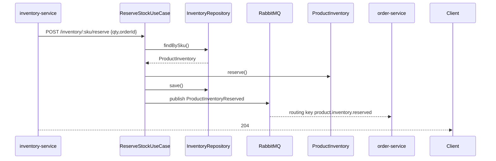
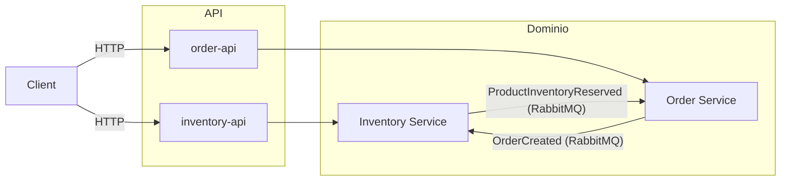

# Proyecto final evolutivo

Intentar dejar el inventory-service totalmente operativo, observable y emitiendo eventos de negocio.

## Tareas

1. Crear el esquema Postgres
   - Copia el prisma/schema.prisma de abajo y ejecuta npx prisma migrate dev --name init_inventory
2. Codificar el núcleo de dominio
   - Crea ProductInventory.ts, Quantity.ts, InventoryRepositoryPort.ts
3. Escribir adaptadores
   - Repositorio Postgres + adaptador de eventos RabbitMQ – ver código; registra ambos en el contenedor Awilix
4. Exponer API HTTP
   - Handlers Fastify (`/inventory/:sku/reserve` y `release`)
5. Conectar OpenTelemetry
   - Verifica métricas y trazas desde Prometheus/Grafana (y, si añades un backend de trazas como Tempo, explora trazas allí)

Fin de la sesión: el servicio puede reservar/liberar/reponer stock, expone métricas y publica un evento `ProductInventoryReserved` que otros servicios pueden consumir.

⸻

## Caso de negocio – Inventory Service (bounded-context único)

### 1.1 Problema que resuelve

La empresa debe garantizar la reservación atómica de stock mientras permite miles de lecturas por segundo, dispara órdenes de compra cuando cae el stock de seguridad y proporciona una trazabilidad completa de movimientos.

### 1.2 Lenguaje ubicuo

Término	Significado
SKU: Código único de producto
Stock Disponible: Unidades aún prometibles
Reserva: Bloquea unidades para un pedido, reversible
Movimiento: Evento inmutable de auditoría (reserve, release, replenish)

### 1.3 A completar
- Value objects
- Agregados (Aggregates)
- Esquema de base de datos (Prisma)
- Puertos y adaptadores
- Eventos de dominio
- Contrato HTTP (inventory-service)
- Secuencia – Reserva
- Integración OpenTelemetry
- Seteo de docker con PG, Prometheus, y Grafana y OTEL
- Tests unitarios y de Integración, con TestContainers


Ejemplo de secuencia:



⸻

## Qué harán los otros servicios

### 2.1 Contexto de sistema



Ambos servicios de dominio sólo hablan vía eventos; las APIs cliente permanecen como fachadas síncronas.

### 2.2 Saga cross-service (camino feliz)

1.	order-api recibe POST /checkout y crea la orden en order-service (`PENDING`)
2.	order-service publica `OrderCreated`
3.	inventory-service consume `OrderCreated` y reserva stock (o falla)
4.	inventory-service publica `ProductInventoryReserved` o `ProductInventoryReservationFailed`
5.	order-service consume el resultado y transiciona la orden (`CONFIRMED` / `CANCELLED`)

Como siguiente paso, puedes codificar dos orquestadores de saga: uno dentro de order-api (HTTP primero), otro dentro de order-service (event-driven fallback).

### 2.3 Topología RabbitMQ

Exchange	Tipo	Routing-keys ejemplo
inventory_events	topic	product.inventory.reserved, product.inventory.released, product.inventory.replenished
order_events	topic	order.created, order.cancelled

Cada servicio posee exactamente un exchange y nunca publica en exchanges ajenos – así la propiedad queda cristalina.

### 2.4 Números de flujo de datos

Paso	SLA	Propietario
Reservar stock	< 50 ms	inventory-service
Crear pedido	< 80 ms	order-service
Propagación de eventos	P99 < 30 ms	clúster RabbitMQ


⸻

## Checklist de calidad y buenas prácticas

•	Aplica las reglas hexagonales: puertos delgados, adaptadores finos, DI con scopes (Prisma singleton, repos por scope) 
•	Testea el dominio en memoria (ejemplo ya escrito) 
•	Nunca loguees/traces desde entidades – instrumenta a nivel de adaptador (evita el anti-patrón “Domain HUD”) 
•	Utiliza el patrón Outbox cuando introduzcas la base de datos de pagos más adelante.

---

## Generar tráfico (cURL)

### 1. Create Inventory

```bash
curl -i \
  -X POST http://localhost:3001/inventory \
  -H "Content-Type: application/json" \
  -d '{"sku":"ABC-1234-AB","qty":10}'
```

### 2. Get Inventory

```bash
curl -i http://localhost:3001/inventory/ABC-1234-AB
```

### 3. Reserve Quantity

```bash
curl -i -X POST http://localhost:3001/inventory/ABC-1234-AB/reserve \
  -H "Content-Type: application/json" \
  -d '{"qty":5,"orderId":"order-001"}'
```

### 4. Release Quantity

```bash
curl -i -X POST http://localhost:3001/inventory/ABC-1234-AB/release \
  -H "Content-Type: application/json" \
  -d '{"qty":3,"orderId":"order-001"}'
```

### 5. Replenish Inventory

```bash
curl -i -X POST http://localhost:3001/inventory/ABC-1234-AB/replenish \
  -H "Content-Type: application/json" \
  -d '{"qty":20}'
```

---

## Ideas de dashboards (PromQL)

### 1. Service Health & Traffic Overview

- **Total RPS**

  ```promql
  sum(rate(http_server_requests_total[1m]))
  ```

- **Latency P95 / P99**

  ```promql
  histogram_quantile(0.95, sum(rate(http_server_request_duration_seconds_bucket[5m])) by (le))
  histogram_quantile(0.99, sum(rate(http_server_request_duration_seconds_bucket[5m])) by (le))
  ```

- **Error Rate (%)**

  ```promql
  100 * sum(rate(http_server_requests_errors_total[1m])) / sum(rate(http_server_requests_total[1m]))
  ```

### 2. HTTP Endpoint Performance

- **Variable:** `$route` (set via *Dashboard settings → Variables → New → Label “route”* with query `label_values(http_server_request_duration_seconds_bucket, route)`)
- **Panels (templated by `$route`)**

  - **RPS by route**

    ```promql
    sum by(route)(rate(http_server_requests_total{route="$route"}[1m]))
    ```

  - **P99 latency by route**

    ```promql
    histogram_quantile(0.99, sum(rate(http_server_request_duration_seconds_bucket{route="$route"}[5m])) by (le,route))
    ```

### 3. Database Query Metrics

- **DB QPS**

  ```promql
  sum(rate(prisma_query_duration_seconds_count[1m]))
  ```

- **Slow Queries P95**

  ```promql
  histogram_quantile(0.95, sum(rate(prisma_query_duration_seconds_bucket[5m])) by (le))
  ```

- **Connection Pool Usage** (if instrumented)

  ```promql
  prisma_pool_active_connections
  ```

### 4. RabbitMQ Messaging Health

- **Messages Published/sec**

  ```promql
  sum(rate(rabbitmq_channel_messages_published_total[1m]))
  ```

- **Queue Depth** (per queue)

  ```promql
  rabbitmq_queue_messages_ready{queue=~".*"}
  ```

- **Consumer Ack Rate**

  ```promql
  sum(rate(rabbitmq_channel_messages_ack_total[1m]))
  ```

### 5. End-to-End Trace Explorer

- **Setup (opcional):** añade un backend de trazas (Tempo) y configúralo como datasource en Grafana
- **Panels:**
  - **Service Map** (built-in)
  - **Recent Traces Table**: link traces to slow requests

### 6. Error & Exception Breakdown

- **Top Exceptions**

  ```promql
  topk(10, sum by(exception)(rate(process_exceptions_total[1m])))
  ```

- **5xx Rate**

  ```promql
  sum(rate(http_server_responses_total{code=~"5.."}[1m]))
  ```

### 7. Resource Utilization

- **CPU (%)**

  ```promql
  rate(process_cpu_seconds_total[1m]) * 100
  ```

- **Memory RSS**

  ```promql
  process_resident_memory_bytes
  ```

- **Event-Loop Lag** (if instrumented)

  ```promql
  nodejs_eventloop_lag_seconds
  ```

### 8. Business-Event Metrics

- **Replenish Events/sec**

  ```promql
  sum(rate(app_event_ProductInventoryReplenished_total[1m]))
  ```

- **Reserve Events/sec**

  ```promql
  sum(rate(app_event_ProductInventoryReserved_total[1m]))
  ```

---

## Análisis de resultados

Checklist rápido para evaluar el proyecto:

- **Correctitud del dominio**: invariantes (no stock negativo), idempotencia en comandos/eventos.
- **Contratos**: endpoints y eventos versionables (tolerant reader).
- **Resiliencia**: retries + DLQ, timeouts y compensaciones (si hay sagas).
- **Performance**: latencia P95/P99 bajo carga y ausencia de cuellos de botella evidentes.
- **Observabilidad**: trazas end‑to‑end, logs correlacionables y métricas accionables.

## Consejos y siguientes pasos

- Introducir **Outbox** antes de “exactly once”.
- Aislar proyecciones de lectura (CQRS) cuando la lectura sea el cuello de botella real.
- Estandarizar: ADRs, C4, Definition of Done y *runbooks* por servicio.

- **Replenish / Reserve Ratio**

  ```promql
  sum(rate(app_event_ProductInventoryReplenished_total[1m]))
  /
  sum(rate(app_event_ProductInventoryReserved_total[1m]))
  ```
